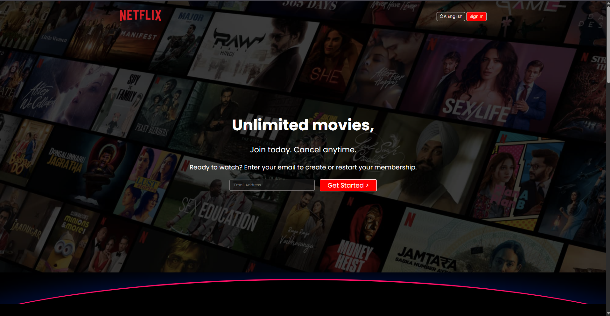
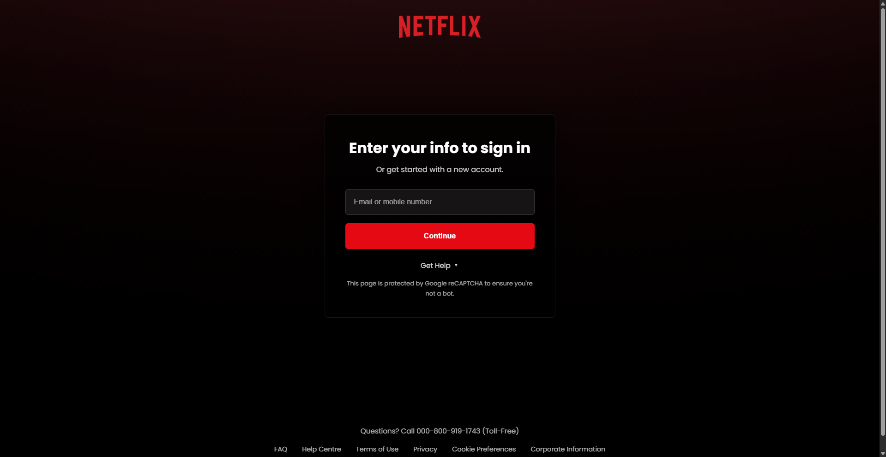

<div align="center">

# 🎬 Netflix UI

### A Modern Netflix-Inspired Login Experience Built with HTML & CSS




</div>

---

## 🚀 Overview

Netflix UI is a frontend recreation of a modern streaming platform login page built using pure HTML and CSS.

The project focuses on creating a visually appealing user interface featuring:

- Cinematic full-screen background
- Dark overlay effects
- Modern authentication form
- Responsive layout
- Smooth transitions and hover effects

The objective was to improve frontend development skills while replicating the look and feel of a premium streaming platform.

---

## ✨ Features

🎥 Full-screen background image

🌑 Dark cinematic overlay

🔐 Modern login form

⚡ Smooth hover animations

📱 Mobile responsive design

🎯 Clean UI structure

💻 Beginner-friendly codebase

🎨 Professional visual styling

---

## 📸 Preview

### Desktop View



---

## 🛠️ Tech Stack

### Frontend

- HTML5
- CSS3

### Concepts Used

- Flexbox
- Responsive Design
- CSS Transitions
- Positioning
- Overlay Effects
- Modern UI Design

---

## 📂 Project Structure

```text
Netflix_UI/
│
├── index.html
├── style.css
├── login.png
├── login.html
├── login.css
└── assets
```

---

## 🎯 Learning Objectives

This project helped me practice:

- Responsive Web Design
- CSS Layout Techniques
- User Interface Recreation
- Visual Hierarchy
- Form Design
- Modern Frontend Development

---

## 🚀 Getting Started

Clone the repository:

```bash
git clone https://github.com/Prathuu24/Netflix_UI.git
```

Navigate to the project:

```bash
cd Netflix_UI
```

Open:

```bash
index.html
```

or simply launch it in your browser.

---

## 🔮 Future Improvements

- [ ] Password visibility toggle
- [ ] Form validation
- [ ] JavaScript interactions
- [ ] Dark/Light mode
- [ ] React version
- [ ] Firebase authentication
- [ ] Animated UI elements

---

## 🤝 Contributing

Contributions, suggestions, and improvements are always welcome.

Feel free to fork the repository and submit a pull request.

---

## ⚠️ Disclaimer

This project is created for educational and portfolio purposes only.

Netflix is a trademark of Netflix, Inc. This project is not affiliated with, endorsed by, or associated with Netflix.

---

<div align="center">

### ⭐ If you enjoyed this project, consider giving it a star!

Built with HTML, CSS, and lots of coffee ☕

</div>
